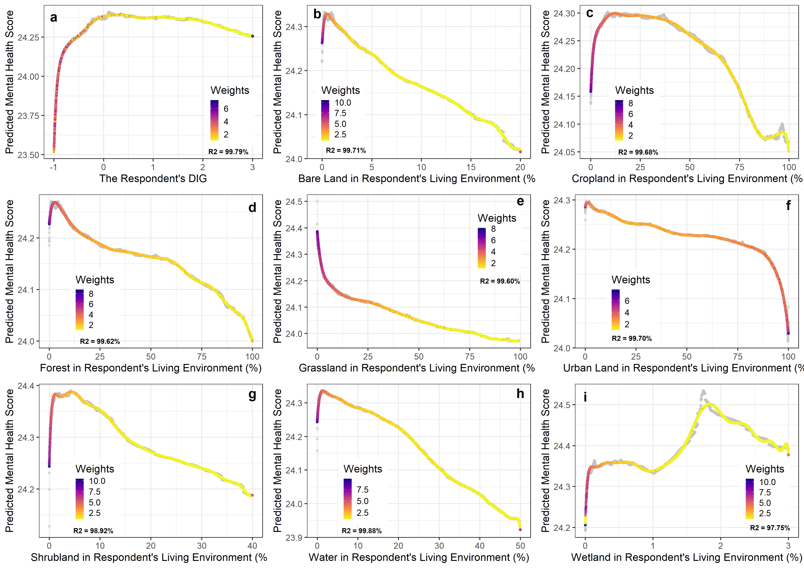

# Mental Health and Land Cover: A Global Analysis Based on Random Forests (DP02)  
Nature features and processes in living environments can help to reduce stress and improve mental. Different land types have disproportionate impacts on mental health. However, the relationships between mental health and land cover are inconclusive. Here, we show the complicated relationships between mental health and percentages of eight land types based on the random forest method. The accuracy, root mean square error, mean square error, and mean absolute error of our model are 90.51%, 1.94, 3.77, and 1.08, respectively, while the mean of the output variable is 24.31. According to the analysis results, we estimate the average monetary values of eight land types, which are an 8.24%-GDP-per-capita (95% CI: 8.17% - 8.32%) increase in the individual income for wetland, 0.44% (95% CI: 0.39% - 0.49%) for bare land, 0.31% (95% CI: 0.39% - 0.49%) for shrubland, 0.10% (95% CI: 0.06% - 0.14%) for forest, 0.09% (95% CI: 0.05% - 0.12%) for water, 0.04% (95% CI: 0 % - 0.07%) for cropland, -0.21% (95% CI: -0.25% - -0.18%) for urban land, and -0.35% (95% CI: -0.39 % - -0.31%) for grassland. Due to complicated relationships, the current land cover composition influences people’s attitudes towards a certain land type. This paper proves that the relationships between mental health and land cover are complicated and far from linear. Furthermore, it provides insights to formulate better land-use policies.  
  
## Author  
Chao Li, Shunsuke Managi  

## Result: Monrtary Values of Land Cover  
  
    
## Result: PPDFs of Features of Interest  
  
  
## R Code  
**[01_DW_BuildDataset_v1.R](03_RCode/01_DW_BuildDataset_v1.R)**: This script is to wash the data to get the data set in the analysis. All features are reserved.  
**[02_AN_MentalHealthRandomForestTest_v1.R](03_RCode/02_AN_MentalHealthRandomForestTest_v1.R)**: This script is to run random forest with 48 features. Aborted.   
**[03_AN_PartialDependenceProfileImprovement_v1.R](03_RCode/03_AN_PartialDependenceProfileImprovement_v1.R)**: This script is to get PPDF based on the PDP from [04_AN_MentalHealthRf47CutRange_v1.R](03_RCode/04_AN_MentalHealthRf47CutRange_v1.R).   
**[04_AN_MentalHealthRf47CutRange_v1.R](03_RCode/04_AN_MentalHealthRf47CutRange_v1.R)**: This script conducts the analysis based on random forest. 47 feature are used. The model is weighted.    
**[05_AN_MarginalSubstitutionRate1hm_v1.R](03_RCode/05_AN_MarginalSubstitutionRate1hm_v1.R)**: This script calculate the monetory values.      
**[06_VI_Visualization_v1.R](03_RCode/06_VI_Visualization_v1.R)**: This script is to visualize the result in the manuscript.     
**[07_AN_Rf47CutRangeMtrySelection_v1.R](03_RCode/07_AN_Rf47CutRangeMtrySelection_v1.R)**: This script is to try Ntry from 11 to 21.  
    
   
## Workflow

**WF.A: 01 -> 04 -> 03 -> 05 -> 06 -> END**  
**WF.A.01.04**: This step get the random forest model and PDPs.  
**WF.A.04.03**: This step fit PDPs to PPDFs.  
**WF.A.03.05**: This step estimate monetary value of land cover based on PPDPs.
**WF.A.05.06**: This step visualize the results.  
   
## Contact Us:
- Email: Prof. Shunsuke Managi <managi@doc.kyushu-u.ac.jp>  
- Email: Chao Li <chaoli0394@gmail.com>
  
## Term of Use:
Authors/funders retain copyright (where applicable) of code on this Github repo. This GitHub repo and its contents herein, including data, link to data source, and analysis code that are intended solely for reproducing the results in the manuscript "Mental Health and Land Cover: A Global Analysis Based on Random Forests". The analyses rely upon publicly available data from multiple sources, that are often updated without advance notice. We hereby disclaim any and all representations and warranties with respect to the site, including accuracy, fitness for use, and merchantability. By using this site, its content, information, and software you agree to assume all risks associated with your use or transfer of information and/or software. You agree to hold the authors harmless from any claims relating to the use of this site.  
  